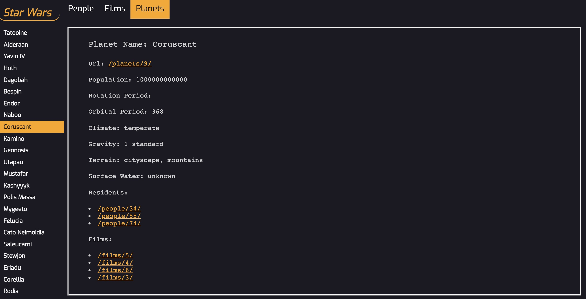

# StarWars-Trivia
**Author: Abhi Balijepalli**

ReactJS web-app that give you in depth detail about Star Wars characters, films, movies and how they overlap.

This data is derived from the [Star Wars API](https://swapi.dev/) (which is missing some movies, unfortunately). The data is in JSON format (which can be directly `import`ed via Webpack) and is split into three different categories:
  * People (`people.json`)
  * Planets (`planets.json`)
  * Films (`films.json`)

Rendered Website:


1) Install : ```npm install```
2) Run: ```npm start``` 
